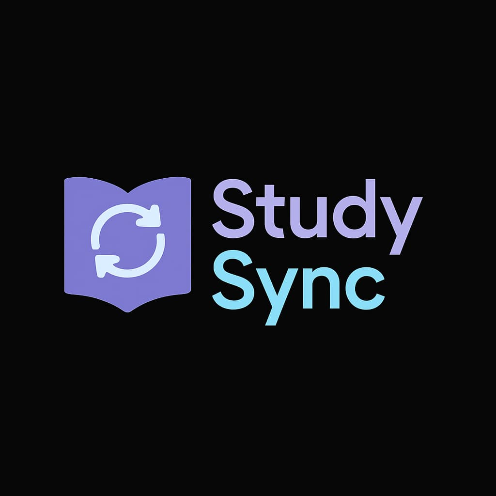

# StudySyncc

<p align="center">
  
</p>

A collaborative study tracking and productivity application built with Next.js and TypeScript. StudySyncc helps students track study time, collaborate in groups, and maintain motivation through challenges and leaderboards.

## Features

- **Study Timer**: Track your study sessions in real-time
- **Calendar Log**: View your study history and patterns
- **Group Collaboration**: Create and join study groups
- **Leaderboard**: Compete with friends to stay motivated
- **Manual Logging**: Add study sessions manually when you forget to use the timer
- **Reminders**: Set study reminders to stay on track

## Getting Started

### Prerequisites

Make sure you have the following installed:

- Node.js (version 14 or later)
- npm (Node package manager)

### Installation

1. Clone the repository:

   ```
   git clone https://github.com/yourusername/studysynnc.git
   ```

2. Navigate to the project directory:

   ```
   cd studysynnc
   ```

3. Install the dependencies:

   ```
   npm install
   ```

### Running the Application

To run the application in development mode, use the following command:

```
npm run dev
```

This will start the development server at `http://localhost:3000`.

### Building for Production

To build the application for production, run:

```
npm run build
```

After building, you can start the production server with:

```
npm start
```

## Project Structure

- `src/components`: UI components organized by feature
- `src/contexts`: React context providers for state management
- `src/models`: TypeScript interfaces and types
- `src/pages`: Next.js pages and API routes
- `src/services`: Service classes for data management
- `src/styles`: Global styles and CSS modules

## Technologies Used

- Next.js
- TypeScript
- Tailwind CSS
- React Context API

## Contributing

Contributions are welcome! Please feel free to submit a Pull Request.

## License

This project is licensed under the MIT License. See the LICENSE file for more details.